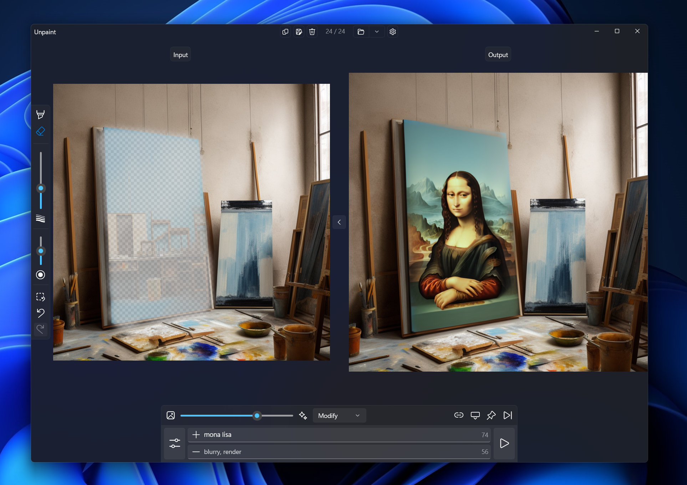

# Introduction

> New: [Unpaint demonstration on Xbox consoles](https://github.com/axodox/unpaint/wiki/Running-Unpaint-on-the-Xbox-Series-consoles), see it on [YouTube](https://www.youtube.com/watch?v=CWhoRcQttCM).

This repository contains a fully C++ implementation of Stable Diffusion-based image synthesis tool called Unpaint. It supports txt2img, img2img and inpainting pipelines and the safety checker. This solution does not depend on Python and runs the entire image generation process in a single process, making deployments significantly simpler and smaller, essentially consisting of a few executable and library files (~30MB), and the model weights (~2.5GB / model). Using the library it is possible to integrate Stable Diffusion into almost any application, which can import C++ or C functions.

For technical details please check the page of the C++ Stable Diffusion library which Unpaint is based on [here](https://github.com/axodox/axodox-machinelearning).

# System requirements

The application uses DirectML, so it should in theory work with all major GPU vendors, however for now it has only been tested on Windows 11 with an NVidia GPU. We encourage you to try it with different hardware and [raise issues](https://github.com/axodox/unpaint/issues) on this page if you have problems. Make sure to install the latest Windows updates and especially the latest GPU drivers, as Unpaints benefits from Microsoft's recent Build conference [announced optimizations](https://devblogs.microsoft.com/directx/dml-stable-diffusion/) greatly.

> Please note that ONNX based pipelines are not yet necessarily as optimized as with using pytorch and CUDA directly, however with latest drivers they are pretty close.

# How to install the app?

You can find the app installers on the [releases page](https://github.com/axodox/unpaint/releases). 

To install the app the *first time* follow these steps:

- Download both the `.msix` and `.crt` files
- Right click the `.crt` file and select install certificate
- In the wizard select `Local Machine` and click next
- Then select `Place all certificates in following Store` and click `Browse`
- Select `Trusted Root Certification Authorities` and click `OK`
- Click `Next` and then `Finish`

> This installs Unpaint's self-signed security certificate which is required by the new MSIX installer pipeline. As the project grows I will likely purchase a proper paid certificate, but it is around 250USD/yr, and I am doing free work here... Windows Store could be a solution as well, which I am looking into. 
 
**If you feel unsafe consider using [SignTool](https://learn.microsoft.com/en-us/dotnet/framework/tools/signtool-exe) to resign the Unpaint package** with your own certificate (you need to import your own one as well), you can refer to the end of [this](https://github.com/axodox/unpaint/blob/main/build_app.ps1) file on how to do it.

After this just open the `.msix` file and should install fine and start the app.

# Building the project

Development environment

- Install [Visual Studio 2022](https://visualstudio.microsoft.com/downloads/)
  - Select the following workloads:
    - Desktop development with C++
    - Universal Windows Platform development
    - Game development with C++
  - Also select these individual packages:
    - C++ (v143) Universal Windows Platform tools
- Install git from [here](https://git-scm.com/downloads) if you do not have it yet
- I did the project with Windows 11, earlier Windows versions might or might not work

Once you have Visual Studio, for the first build follow these steps:

- Clone the repo with `git clone https://github.com/axodox/unpaint`
- Open `Unpaing.sln` with Visual Studio
  - If Visual Studio prompts you that you still need to install something, then follow its instructions
  - You could also get a prompt to enable `Developer Mode` in Windows, which you can do in the `Settings` app
- Open the `Config` folder in the `Unpaint` project in `Solution Explorer`, and double click `Package.appxmanifest`
- Go to the `Packaging` tab, and select `Choose Certificate`
- Press `Create` and follow the wizard

After this, you can just start the project and have it be built and run. Enjoy :)
